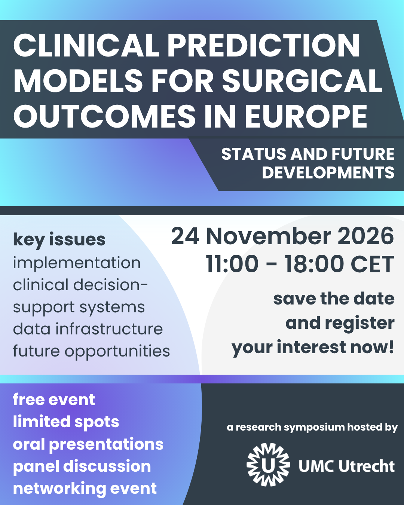

The website hosts information related to the research symposium entitled: "Clinical Prediction Models for Surgical Outcomes in Europe – Status and Future Developments". 

## Event Flyer

::: {.text-center}
{fig-alt="Event Flyer" width=80% max-width=600px}

 

<a href="images/flyer.png" class="btn btn-outline-primary" download="Symposium_Flyer.png">📥 Download Flyer Image</a>
:::

# Context

The European Commission suggested the use of algorithms to predict health outcomes, as one of the plausible strategies to improve the overall efficiency and effectiveness of European healthcare systems. 

Predictive analytic tools support the establishment of an evidence-based and shared decision-making process, by predicting individual’s risks of adverse events or poor outcomes. This is particularly relevant for commonly performed surgical procedures for which up to one in ten patient may not be satisfied with postoperative functional outcomes, such as total knee arthroplasty, total hip arthroplasty, shoulder surgery or hand surgery.

However, to generate value, clinical prediction models require the achievement of several steps, such as a proper data infrastructure, careful model conception, development, validation and navigation through regulatory landscape. Indeed, since 2021, the European Union (EU) in its artificial intelligence (AI) act, classified decision-support system tools involving outcome prediction models in healthcare, as high-risk AI-based systems. This  implies that developers need to comply with high safety, quality and transparency standards. 

This research symposium will invite leading experts in that field to learn from each other, with the subsequent objective to establish potential collaborations and move forward research and tools in the field of clinical prediction models for surgical outcomes.

# Societal Impact

The developed knowledge will be essential to bring computer scientists, data scientists, epidemiologists and clinicians closer, for a better quality of care. As a societal challenge, surgical procedures are common and will increase in numbers with the ageing of European populations. Moreover, surgical procedures present specific significant challenges, such as the use and report of functional outcomes and patient-reported outcome measures (PROMs). 

The symposium will put the emphasis on the technology and systems required for large-scale clinical prediction models to generate value. The symposium will therefore cover key steps from model conceptualization to model implementation, deployment (and certification). By describing the necessary data infrastructure and analysing how clinical prediction models—whether they are developed by more classical regression or modern AI approaches—comply as high-risk systems under the EU AI Act, the symposium will directly support the work of applied researchers.

::: {.callout-tip icon=falseAppearance}
## Registration is Now Open!
To secure your spot and receive your automatic calendar blocker invitation, please complete our form.

<a href="https://forms.cloud.microsoft/Pages/ResponsePage.aspx?id=PUrf3MDQY0qUz3gZgSSb5TSsRhgHAaxEneI2iwjKTvdUMzI4SDBQTTREVkgyT0tBQzRHUUlEQUM3Ni4u" class="btn btn-primary btn-lg" target="_blank" role="button"> Register for the Symposium</a>
:::